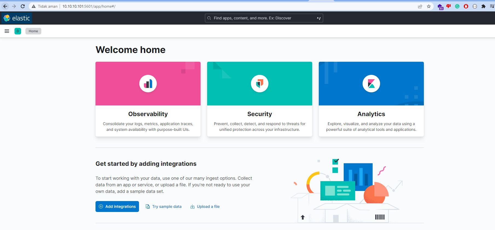

# ELK Stack Documentation

Repository ini berisi tentang tutorial instalasi dan konfigurasi ELK Stack

## Environment For ElasticSearch Cluster

**Cluster** : 1 Cluster

**Node** : 3 Node

**OS** : Ubuntu Server 20.04

**Elasticsearch Version** : 8.x Latest


## Elasticsearch Installation

Dalam dokumentasi resmi yang di publish disini [[1]](https://www.elastic.co/guide/en/elasticsearch/reference/current/install-elasticsearch.html). Elasticsearch menyediakan berbagai macam pilihan metode/packages untuk berbagai environment seperti `Windows .zip archive`,`deb`,`rpm`,`docker`, dan `Elastic Cloud on Kubernetes`. Dan untuk dokumentasi ini kita akan menggunakan packages `deb` untuk instalasi elasticsearch.

Elasticsearch menggunakan Signing Key (PGP key D88E42B4, available from https://pgp.mit.edu) dengan fingerprint:

`4609 5ACC 8548 582C 1A26 99A9 D27D 666C D88E 42B4`

Download dan install public signing key:

```bash
wget -qO - https://artifacts.elastic.co/GPG-KEY-elasticsearch | sudo gpg --dearmor -o /usr/share/keyrings/elasticsearch-keyring.gpg
```

Install terlebih dahulu apt-transport-https package on Debian sebelum lanjut:

```bash
sudo apt-get install apt-transport-https
```

Simpan repository yang di definisikan di `/etc/apt/sources.list.d/elastic-8.x.list`:

```bash
echo "deb [signed-by=/usr/share/keyrings/elasticsearch-keyring.gpg] https://artifacts.elastic.co/packages/8.x/apt stable main" | sudo tee /etc/apt/sources.list.d/elastic-8.x.list
```

Lakukan update repository dan install elasticsearch

```bash
sudo apt-get update && sudo apt-get install elasticsearch -y
```

## Konfigurasi Node Elasticsearch

Setelah melakukan instalasi selanjutnya masuk kedalam file konfigurasi elasticsearch

```bash
nano /etc/elasticsearch/elasticsearch.yml
```

Uncomment syntax dibawah ini untuk mendefinisikan cluster elasticsearch dan beri nama sesuai dengan kebutuhan anda

```bash
#cluster.name: my-application
```


Uncomment syntax dibawah ini untuk mendefinisikan network host sesuai dengan IP Server yang dipakai

```bash
#network.host: 192.168.0.1
```


Uncomment syntax dibawah ini untuk mendefinisikan port sesuai dengan yang anda mau

```bash
#http.port: 9200
```


Uncomment syntax dibawah ini untuk mendefinisikan discovery dari setiap host untuk clustering (gunakan IP host dari setiap node elasticsearch)

```bash
#discovery.seed_hosts: ["host2", "host2"]
```


Uncomment syntax dibawah ini untuk mendefinisikan master node yang eligible dari setiap node

```bash
#cluster.initial_master_nodes: ["node-1", "node-2"]
```


comment syntax dibawah ini agar tidak terjadi bentrok

```bash
#cluster.initial_master_nodes: ["node-1"]
```


Setelah semua sudah di konfigurasi sesuai dengan kebutuhan, lakukan save dan keluar dari text editor

Selanjutnya, jalankan service elasticsearch dan `enabled` service agar otomatis berjalan saat server mengalami reboot

```bash
systemctl start elasticsearch
systemctl enable elasticsearch
```

test elasticsearch dengan menggunakan `curl`

```bash
curl -X GET "10.10.10.101:9201"
```

Maka akan di respon seperti dibawah ini

```
{
  "name" : "node-1",
  "cluster_name" : "elk-cluster",
  "cluster_uuid" : "_na_",
  "version" : {
    "number" : "8.3.2",
    "build_type" : "deb",
    "build_hash" : "8b0b1f23fbebecc3c88e4464319dea8989f374fd",
    "build_date" : "2022-07-06T15:15:15.901688194Z",
    "build_snapshot" : false,
    "lucene_version" : "9.2.0",
    "minimum_wire_compatibility_version" : "7.17.0",
    "minimum_index_compatibility_version" : "7.0.0"
  },
  "tagline" : "You Know, for Search"
}
```

Lakukan ulang untuk setiap node yang akan dijadikan satu cluster

## Instalasi & Konfigurasi Kibana

Untuk kibana ini akan kita install pada `Node-1`

Instal kibana dengan menggunakan perintah dibawah ini

```bash
apt-get install kibana -y
```

buka file konfigurasi kibana dan lakukan konfigurasi sesuai dengan kebutuhan

```bash
nano /etc/kibana/kibana.yml
```

Uncomment syntax dibawah ini untuk mendefinisikan port dari kibana

```bash
#server.port: 5601
```


uncomment syntax dibawah ini untuk mendefinisikan network host sesuai dengan IP Server yang dipakai

```bash
#server.host: "localhost"
```


uncoment syntax dibawah ini untuk mengkoneksikan kibana dengan elasticsearch

```bash
#elasticsearch.hosts: ["http://localhost:9200"]
```


setelah di konfigurasi sesuai dengan kebutuhan, lakukan save dan keluar dari text editor

jalankan service kibana dengan perintah dibawah ini

```bash
systemctl start kibana
systemctl enable kibana
```

akses kibana di web browser dengan alamat http://<ip host>:5601

```bash
http://10.10.10.101:5601
```



## Instalasi & Konfigurasi Logstash

Untuk Logstash ini akan kita install di VM yang berbeda dengan cluster elasticsearch. Maka dari ini kita perlu menambahkan repository terlebih dahulu

Download dan install public signing key:

```bash
wget -qO - https://artifacts.elastic.co/GPG-KEY-elasticsearch | sudo gpg --dearmor -o /usr/share/keyrings/elasticsearch-keyring.gpg
```

Install terlebih dahulu apt-transport-https package on Debian sebelum lanjut:

```bash
sudo apt-get install apt-transport-https
```

Simpan repository yang di definisikan di `/etc/apt/sources.list.d/elastic-8.x.list`:

```bash
echo "deb [signed-by=/usr/share/keyrings/elasticsearch-keyring.gpg] https://artifacts.elastic.co/packages/8.x/apt stable main" | sudo tee /etc/apt/sources.list.d/elastic-8.x.list
```

Lakukan update repository dan install logstash dengan perintah dibawah ini

```bash
sudo apt-get update && sudo apt-get install logstash -y
```

konfigurasi logstash untuk inputan dari filebeat

```bash
nano /etc/logstash/conf.d/01-beats-input.conf
```

masukkan syntax dibawah ini untuk mengkonfigurasi inputan dari filebeat

```bash
input {
  beats {
    port => 5044
  }
}
```

konfigurasi logstash untuk outputan ke elasticsearch

```bash
nano /etc/logstash/conf.d/02-elasticsearch-output.conf
```

masukkan syntax dibawah ini untuk mengkonfigurasi outputan ke elasticsearch

```bash
output {
  if [@metadata][pipeline] {
    elasticsearch {
    hosts => ["10.10.10.101:9201"]
    manage_template => false
    index => "%{[@metadata][beat]}-%{[@metadata][version]}-%{+YYYY.MM.dd}"
    pipeline => "%{[@metadata][pipeline]}"
    }
  } else {
    elasticsearch {
    hosts => ["10.10.10.101:9201"]
    manage_template => false
    index => "%{[@metadata][beat]}-%{[@metadata][version]}-%{+YYYY.MM.dd}"
    }
  }
}
```

save dan keluar dari text editor. verifikasi konfigurasi logstash dengan perintah dibawah ini

```bash
sudo -u logstash /usr/share/logstash/bin/logstash --path.settings /etc/logstash -t
```

```bash
systemctl start logstash
systemctl enable logstash
```

## Authors

- [Ahmad Naoval Annasik](https://www.github.com/octokatherine)
